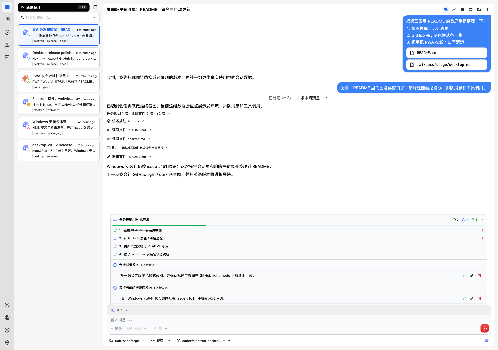

# 桌面应用

返回入口：[index.md](../index.md)

<picture>
  <source media="(prefers-color-scheme: dark)" srcset="../../../.docs/zh-hans/desktop-chat-dark.png">
  
</picture>

## 获取安装包

如果不从源码启动，而是直接安装桌面应用：

- 从 [GitHub Releases](https://github.com/vibe-forge-ai/vibe-forge.ai/releases) 下载 `desktop-v*` tag 对应的产物
- macOS：Intel（`x64`）与 Apple Silicon（`arm64`）分别提供 `.dmg`、`.zip`
- Windows：正式安装包暂未提供，后续补发见 [#161](https://github.com/vibe-forge-ai/vibe-forge.ai/issues/161)
- Linux：`.AppImage`、`.deb`、`.tar.gz`

如果你希望由 launcher 自动处理下载和首次启动，也可以直接运行：

```bash
npx @vibe-forge/bootstrap app
npx @vibe-forge/bootstrap app cache
npx @vibe-forge/bootstrap app --no-cache
```

`bootstrap app` 会记住上次选择的桌面安装位置；如果之前没有记录，会先询问是安装到用户目录还是 bootstrap cache，再把当前目录作为 workspace 传给桌面应用。

- `bootstrap app cache`：显式走 cache；如果 cache 里已经有对应 release，就直接从 cache 启动
- `bootstrap app --no-cache`：显式回到用户目录安装模式

`bootstrap app` 与桌面应用的协作方式：

- 当前 shell 所在目录会作为 workspace 传给桌面应用
- 如果桌面应用尚未运行，会直接打开这个项目
- 如果桌面应用已经运行：
  - 同一个目录只会复用已有本机 service，并聚焦现有项目窗口
  - 新目录会通知已运行的桌面进程为该目录启动新的本机 service，并打开对应项目窗口

当前桌面 release / CI artifact 默认不签名，首次运行时系统可能会提示安全确认。

## 本地试用

在仓库根目录执行：

```bash
pnpm desktop:dev
```

该命令会先构建 Web UI 静态产物，再启动 Electron。Electron 会在本机随机端口启动 Vibe Forge UI server，并打开 `/ui/`。

开发态默认 workspace 按以下顺序解析：

- `VF_DESKTOP_WORKSPACE`
- `__VF_PROJECT_WORKSPACE_FOLDER__`
- 启动命令所在目录
- 仓库根目录

打包后的桌面应用如果没有收到 workspace，不会直接进入聊天页，而是先显示项目选择页；只有选中了最近项目或手动打开目录后，才会继续后面的流程。

## 项目选择与多窗口

桌面应用会把最近使用过的项目保存到本地状态里，并在项目选择页与菜单中统一展示：

- 项目名使用目录名
- 项目说明使用完整文件路径
- 项目选择页会同时展示 `Running Projects` 和 `Recent Projects`

窗口与 service 行为：

- 同一个规范化目录最多只会启动一个本机 service
- 已经打开的目录再次启动时，不会重复起 service，而是直接聚焦已有窗口
- 不同目录会各自启动独立的本机 service，并可以同时保留多个项目窗口
- 项目窗口标题固定使用 `目录名 - Vibe Forge`

菜单入口：

- `File -> Open Workspace...`：直接选择一个目录并打开对应项目窗口
- `File -> Switch Project...`：打开项目选择页，可以在运行中的项目和最近项目之间切换
- `File -> Open Recent`：从最近项目列表直接打开
- `File -> Running Projects`：在已经运行的项目窗口之间快速切换

每个项目自己的本机 service 数据会写到 Electron `userData` 目录下的独立子目录：

- `workspaces/<workspace-key>/db.sqlite`
- `workspaces/<workspace-key>/data/`
- `workspaces/<workspace-key>/logs/`

## 连接模式

桌面应用默认会启动一个本机服务，并把 Web UI 直接连到这个本机服务：

- 本机服务由 Electron 自动启动，不需要额外执行 `vfui-server`
- 本机服务默认关闭 `webAuth`
- 会话、数据库和日志默认写入 Electron `userData` 目录

桌面端同时支持切换到其他 Vibe Forge 服务端，适合这些场景：

- 本机 Electron 只作为控制台，实际执行放在远端机器
- 一台 Electron 管理多台不同环境的执行服务器
- 本机服务和远端服务之间来回切换

切换入口：

- 侧边栏账号菜单里的“切换后端服务”
- 登录失败页里的“切换后端服务”

切到远端服务后，前端会复用 PWA/独立部署那套连接逻辑：

- 按服务地址保存连接历史
- 按服务地址分别保存 bearer token
- 首次连接会检查前后端版本兼容
- 远端服务如对公网或跨设备开放，仍建议开启 `webAuth`

桌面应用切到远端服务时，本机内置服务仍会继续在后台运行；`File -> Open Workspace...`、`File -> Switch Project...` 和项目选择页改动的是本机内置 service 列表，不会修改远端服务的 workspace。

## 打包与发布

本地打包、CI 产物、签名、公证和自动更新见：[桌面打包与发布](./desktop-packaging.md)。

## 当前边界

- 桌面壳仍复用现有 `@vibe-forge/server`，业务逻辑不在 Electron main 进程中重复实现。
- server 数据默认按 workspace 写入 Electron `userData/workspaces/<workspace-key>/` 目录。
- 当前包暂不启用 asar，以保留 pnpm deploy 生成的依赖布局；后续如果 server/runtime 改为 dist 构建或打平依赖，可以再启用 asar。
- 当前图标是临时品牌图标，正式发布前需要替换为最终品牌图标。
- macOS / Windows 正式分发需要配置真实签名证书；没有证书时 CI 仍会生成未签名安装包 artifact。
- Terminal 视图依赖 `node-pty`；正式分发前需要继续验证 Electron native rebuild。
