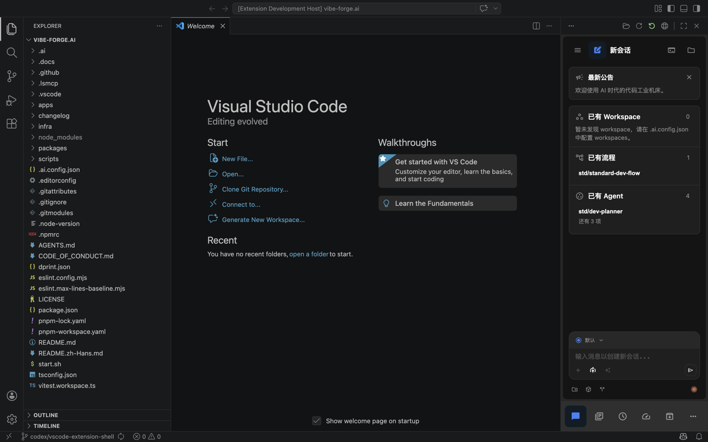

# VS Code 扩展

返回入口：[index.md](../index.md)

VS Code 扩展位于 `apps/vscode-extension`，当前是一个薄壳：

- 通过右侧 Secondary Side Bar 的 Vibe Forge 入口打开完整 client。
- 通过 `Vibe Forge: Open Workspace` 切换当前右侧边栏控制的 workspace。
- 每个 workspace folder 会启动并复用一个本机 Vibe Forge UI server。
- 多个 workspace folder 可以同时保留各自的 server；右侧边栏显示当前选中的 workspace。
- Webview 内打开该 server 托管的 `/ui/`，界面复用 `@vibe-forge/bootstrap web` 启动的集成 Web UI。
- Server 通过用户环境里的 `vibe-forge-bootstrap` / `vfb` 启动 `web` 子命令，业务逻辑不在扩展中重复实现。

扩展不内置、不自动安装 Vibe Forge runtime 包。它只嗅探用户环境里的 bootstrap 启动器，并在找不到时提示安装或配置。

## 效果预览



用户在右侧 Secondary Side Bar 选择 Vibe Forge 后，右侧边栏会直接承载完整 client。当前选中的 workspace 会对应一个本机 UI server，侧边栏顶部命令可用于切换 workspace、刷新视图、重启当前项目 server 或在浏览器中打开同一界面。

## 本地试用

在仓库根目录执行：

```bash
pnpm vscode:compile
```

随后在 VS Code 的 Extension Development Host 中执行：

```text
Vibe Forge: Open Workspace
```

要控制某个项目，需要先让该项目或系统环境里能找到 bootstrap 启动器：

```bash
pnpm add -D @vibe-forge/bootstrap
```

也可以通过 Homebrew 安装全局启动器：`brew install vibe-forge-ai/tap/vibe-forge-bootstrap`。

## 运行模型

扩展默认按 workspace folder 隔离 server：

- bootstrap 查找顺序：`vibeForge.bootstrapCommand`、`VF_VSCODE_BOOTSTRAP_COMMAND`、当前 workspace 的 `node_modules/.bin`、系统 `PATH`。
- 扩展找到 `vibe-forge-bootstrap` / `vfb` 后，会执行 `web` 子命令，并传入当前 workspace、随机端口、`/ui` base、extension global storage 下的数据目录与日志目录。
- server 监听 `127.0.0.1` 的随机端口。
- `webAuth` 默认关闭。
- 数据库、日志和运行数据写入 VS Code extension 的 global storage，并按 workspace path hash 分目录。
- 右侧边栏 webview 使用 iframe 打开本机 server 的 `/ui/`。

多根 workspace 下，右侧边栏默认优先使用当前编辑器所在的 workspace folder；无法判断时使用第一个 workspace folder。执行 `Vibe Forge: Open Workspace` 可以手动切换。

再次执行 `Vibe Forge: Open Workspace` 时，扩展会切换右侧边栏当前 workspace；已启动过的其他 workspace server 会继续保留，直到执行停止命令或扩展停用。

## 配置项

- `vibeForge.bootstrapCommand`：可选的 `vibe-forge-bootstrap` 可执行文件、命令名或 wrapper command。

如果项目未把 `@vibe-forge/bootstrap` 安装到本地依赖，也可以把 `vibeForge.bootstrapCommand` 指向系统安装的 `vibe-forge-bootstrap`、`vfb` 或其他兼容 wrapper。

## 当前边界

- 当前扩展只提供 webview 壳和 per-project server 生命周期管理。
- 完整 client 当前直接嵌入 VS Code 右侧边栏；宽度由用户拖拽右侧边栏控制。
- 扩展不会为用户自动安装 `@vibe-forge/bootstrap`。

## 打包与发布

在仓库根目录执行：

```bash
pnpm vscode:package
```

该命令会生成本地 `.vsix`。CI 中，VS Code extension 变更会触发专用 workflow 构建并上传 `.vsix` artifact；推送 `vscode-extension-v*` tag 时会校验 tag 版本与 `apps/vscode-extension/package.json` 版本一致，打包 VSIX，配置了 `VSCODE_EXTENSION_PUBLISHER` 与 `VSCE_PAT` 时发布到 VS Code Marketplace，并把 VSIX 附加到 GitHub Release。
