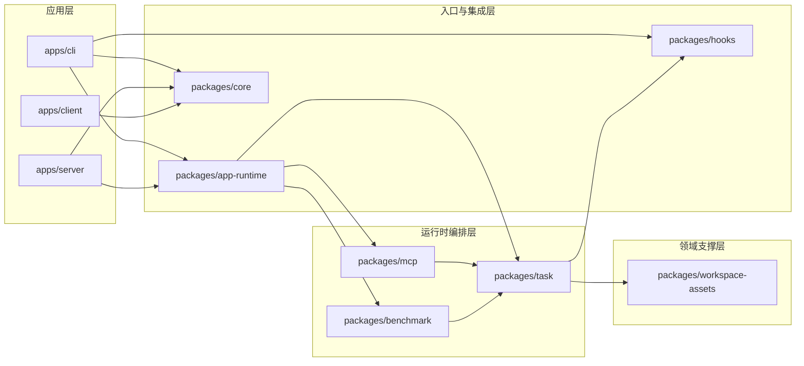
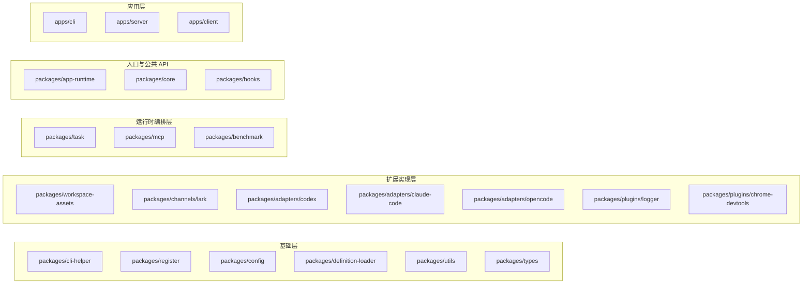
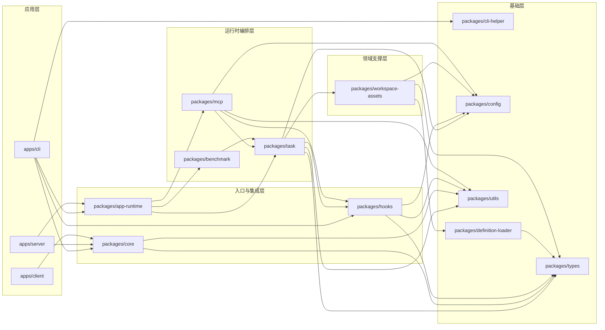
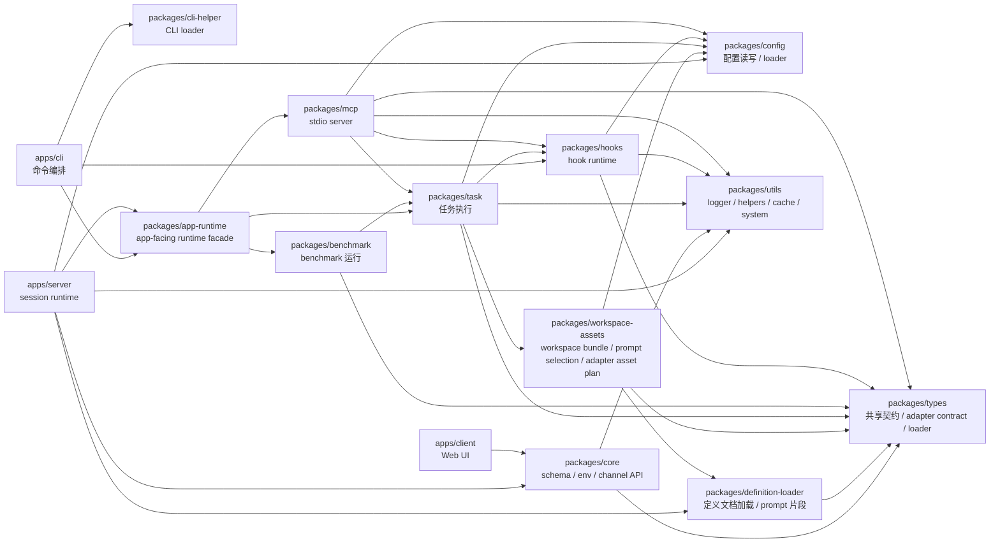
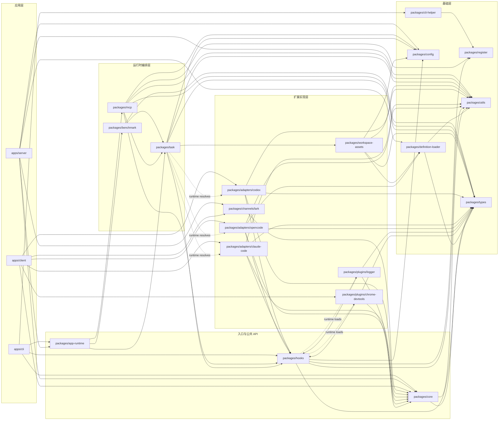

# 架构说明

本文档描述当前仓库里各个运行时包的职责边界，以及 `vf`、`vf-mcp`、`vf-call-hook` 三条主链路的装配方式。

## 包分层

- `apps/cli`
  - 面向用户的主 CLI。
  - 负责 `vf run`、`vf list`、`vf clear`、`vf stop`、`vf kill`、`vf benchmark` 等命令编排。
- `apps/server`
  - UI server / session runtime。
  - 负责 HTTP / WebSocket 接口、会话启动、通知与配置写回。
- `apps/client`
  - Web UI。
  - 复用 session / config / benchmark 共享契约，不直接接触 benchmark runtime 或文件系统。
- `packages/cli-helper`
  - CLI 基础设施 loader。
  - 负责补齐 `NODE_OPTIONS`、开启 `__vibe-forge__` 条件、挂 `@vibe-forge/register/preload`，并把信号与退出码透传给真实入口。
- `packages/types`
  - 共享基础类型层。
  - 提供 `Config`、`Cache`、definition schema、workspace asset contract、adapter contract / loader、`ChatMessage`、`Session`、`TaskDetail`、`WSEvent`、`LogLevel`、hook 插件配置契约，以及 task <-> mcp 的 binding contract。
- `packages/config`
  - 通用配置加载层。
  - 负责 `defineConfig()`、`.ai.config.*` / `.ai.dev.config.*` 的查找、变量替换、缓存重置、配置写回，以及默认 system prompt 策略。
- `packages/app-runtime`
  - app-facing runtime facade。
  - 对 `apps/*` 暴露 task / benchmark 入口，并携带内建 `vibe-forge` MCP 的安装锚点。
- `packages/utils`
  - 通用运行时工具层。
  - 负责 markdown logger、log level 解析、字符串 key 转换、definition/path 命名 helper、uuid、message text 提取、cache、model selection，以及系统通知 helper。
- `packages/definition-loader`
  - 定义文档加载层。
  - 负责 rules / skills / specs / entities 的发现、读取与 prompt 片段生成。
- `packages/workspace-assets`
  - workspace asset 领域层。
  - 负责 workspace assets 发现、hook 插件资产投影、prompt asset 选择与 adapter asset plan 组装。
- `packages/channels/lark`
  - 当前的 channel 实现包。
  - 基于 `core` 的 channel DSL 提供 channel definition / connection，供 server runtime 与 client 配置界面复用。
- `packages/adapters/*`
  - adapter 实现包族。
  - 当前包括 `codex`、`claude-code`、`opencode`；由 task runtime 按包名解析执行，也向 client 暴露 schema / icon 等元数据。
- `packages/plugins/*`
  - hook plugin 实现包族。
  - 当前包括 `logger`、`chrome-devtools`；由 hooks runtime 解析执行，部分包也向 client 暴露 tool schema。
- `packages/hooks`
  - 独立的 hooks runtime 包。
  - 暴露 `vf-call-hook`。
  - 承载 hook 输入输出类型、plugin runtime、native helper、bridge loader。
- `packages/task`
  - 任务执行层。
  - 负责 `prepare()`、`run()`、adapter query options 生成。
- `packages/benchmark`
  - benchmark 领域层。
  - 负责 benchmark case 发现、workspace 准备、运行、结果读写。
- `packages/mcp`
  - 独立的 MCP stdio server 包。
  - 暴露 `vf-mcp` / `vibe-forge-mcp`。
  - 内含基础 MCP 工具，并在包内直接组装默认 task 工具依赖，承担 MCP 侧运行时编排。
- `packages/core`
  - 共享公共 API 层。
  - 负责 schema、channel DSL、env、ws 类型和对外统一导出。

## 分层图（不含基础层）

这张图只展示主干依赖，不枚举所有 `package.json` 直接依赖。



## 层级示意图（无连线）

这张图只表达分层归属，不表达依赖关系。



## 分层图（含基础层）

这张图只展示主干依赖，不枚举所有 `package.json` 直接依赖。



## 主干包关系图

这张图展示的是当前架构主干上的关键包关系，不覆盖所有 workspace 直接依赖。



## 完整包关系图（含 channels / adapters / plugins）

这张图补充展示扩展实现包。

- 实线：静态 workspace 依赖或直接消费关系
- 虚线：运行时按包名解析，不一定体现在 `package.json`



## 依赖图工具建议

如果要把这类图进一步自动化，优先考虑下面两个 npm 工具：

- `dependency-cruiser`
  - 更适合 monorepo 和 TypeScript。
  - 可以输出 `dot`、`mermaid`、`html`，也能顺手做分层约束检查。
- `madge`
  - 更轻量，适合快速看 import graph 和循环依赖。

但对这个仓库来说，真正想维护的是“workspace package 级别”的图，而不是“文件 import 级别”的图。\
所以当前更稳的方式仍然是：用一个小脚本读取各个 `package.json` 的 workspace 依赖，再手工收敛成 Mermaid 图。这样更容易控制分层语义，也不会把文件级别的噪音一起带进来。

## 启动链路

### `vf run`

1. `apps/cli/cli.js`
2. `@vibe-forge/cli-helper/loader`
3. `apps/cli/src/cli.ts`
4. `apps/cli/src/commands/run.ts`
5. `@vibe-forge/app-runtime.generateAdapterQueryOptions()`
6. `@vibe-forge/app-runtime.run()`
7. `packages/task/src/prepare.ts`
8. `@vibe-forge/config` / `@vibe-forge/utils` / `@vibe-forge/definition-loader` / `@vibe-forge/workspace-assets` 共同完成 config、logger、definition 文档装配、workspace assets 与默认内建 MCP 装配，其中默认 system prompt 的开关解析与默认内建 MCP 解析位于 `@vibe-forge/config`
9. adapter query

### `vf-mcp`

1. `packages/mcp/cli.js`
2. `@vibe-forge/cli-helper/loader`
3. `packages/mcp/src/cli.ts`
4. `packages/mcp/src/command.ts`
5. `packages/mcp/src/tools/*`
   - task tools 直接引用 `@vibe-forge/task`、`@vibe-forge/hooks`、`@vibe-forge/config` 与 `packages/mcp/src/sync.ts`
6. `@modelcontextprotocol/sdk` stdio server

`vf-mcp` 默认会带上 `StartTasks` / `GetTaskInfo` / `StopTask` / `ListTasks` 这组 task 工具。

### `vf-call-hook`

1. `packages/hooks/call-hook.js`
2. `packages/hooks/src/entry.ts`
3. 优先加载当前 active adapter 的 `./hook-bridge`
4. 未命中时回退 `packages/hooks/src/runtime.ts`
5. runtime 通过 `@vibe-forge/config` 读取配置，通过 `@vibe-forge/utils` 处理 logger、log level 与输入转换
6. plugin middleware 链

## 默认内建 MCP

默认情况下，`task prepare` 会把内建 `vibe-forge` MCP server 作为 fallback MCP asset 注入到 workspace bundle 中。

关键实现位置：

- `packages/config/src/default-vibe-forge-mcp.ts`
- `packages/task/src/prepare.ts`

它的本质是一个本地 stdio server：

- `command = process.execPath`
- `args = [<resolved @vibe-forge/mcp>/cli.js]`

在 workspace 外，`@vibe-forge/config` 会优先沿着 `@vibe-forge/app-runtime` 的依赖树解析这个 `@vibe-forge/mcp` 安装位置。

这样 `vf run`、server session、以及 MCP task manager 内部启动的子任务，都会默认拥有同一套 Vibe Forge MCP 工具能力。

### 关闭方式

优先级从高到低：

1. 运行参数 `useDefaultVibeForgeMcpServer`
2. 配置 `noDefaultVibeForgeMcpServer`
3. 默认值 `true`

CLI 对应开关：

- `vf run --no-default-vibe-forge-mcp-server`

配置文件对应开关：

```yaml
noDefaultVibeForgeMcpServer: true
```

如果只是想屏蔽某个同名 server，而不是关闭默认注入机制，继续使用 `mcpServers.include/exclude`、`defaultIncludeMcpServers`、`defaultExcludeMcpServers`。

## 文档交叉入口

- [使用文档](./USAGE.md)
- [Hooks 文档](./HOOKS.md)
- [仓库开发](./DEVELOPMENT.md)
- [CLI 维护说明](/Users/bytedance/projects/vibe-forge.ai/apps/cli/src/AGENTS.md)
- [Types 维护说明](/Users/bytedance/projects/vibe-forge.ai/packages/types/AGENTS.md)
- [App Runtime 维护说明](/Users/bytedance/projects/vibe-forge.ai/packages/app-runtime/AGENTS.md)
- [Workspace Assets 维护说明](/Users/bytedance/projects/vibe-forge.ai/packages/workspace-assets/AGENTS.md)
- [Task 维护说明](/Users/bytedance/projects/vibe-forge.ai/packages/task/AGENTS.md)
- [Benchmark 维护说明](/Users/bytedance/projects/vibe-forge.ai/packages/benchmark/AGENTS.md)
- [Config 维护说明](/Users/bytedance/projects/vibe-forge.ai/packages/config/AGENTS.md)
- [Utils 维护说明](/Users/bytedance/projects/vibe-forge.ai/packages/utils/AGENTS.md)
- [Hooks 维护说明](/Users/bytedance/projects/vibe-forge.ai/packages/hooks/AGENTS.md)
- [MCP 维护说明](/Users/bytedance/projects/vibe-forge.ai/packages/mcp/AGENTS.md)
