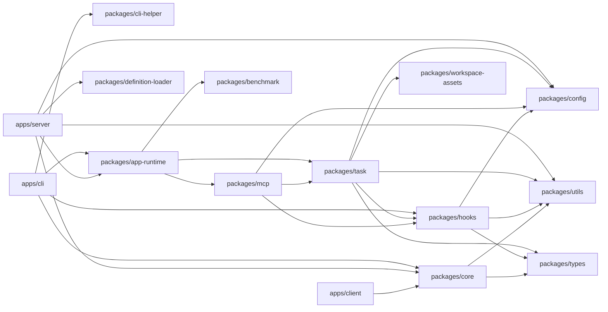

# 架构依赖

返回入口：[ARCHITECTURE.md](../ARCHITECTURE.md)

## 主干关系

## 依赖方向

- 应用层依赖 runtime / core，不反向。
- `task` 是 adapter 的运行时入口；adapter 由运行时解析，不让 app 直接编排。
- `hooks`、`mcp`、`benchmark` 共享 `config` / `utils` / `types`，避免各自复制协议。
- `workspace-assets`、`definition-loader` 是 task 侧的领域支撑层。

## 扩展实现

- `channels/*`：由 Server / Client 消费 channel contract。
- `adapters/*`：由 `task` 在运行时按包名解析。
- `plugins/*`：由 `hooks` 在运行时装载。
