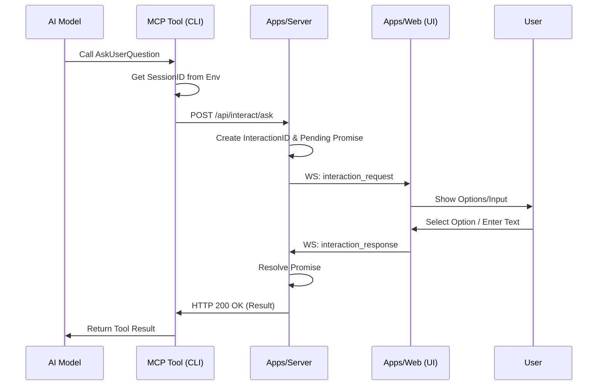

# 实现 CLI 到 Web 的 AskUserQuestion 交互方案

本方案旨在实现一个通过 MCP 协议触发的前后端交互机制，允许 AI 工具向用户发起提问（选择或文本），并在 Web 界面直接操作反馈。

## 1. 核心层改造 (`packages/core`)

### 1.1 环境变量注入

修改 `packages/core/src/controllers/task/prepare.ts`，在加载 MCP Server 配置时，将当前会话 ID 注入到环境变量中。

```typescript
// src/controllers/task/prepare.ts
mcpServer.env = {
  ...mcpServer.env,
  __VF_PROJECT_AI_TASK_ID__: taskId,
  __VF_PROJECT_AI_SESSION_ID__: sessionId
}
```

### 1.2 类型定义 (Zod)

在 `packages/core/src/schema.ts` 中使用 Zod 定义交互协议，并在 `packages/core/src/types.ts` 中导出推断类型。

```typescript
import { z } from 'zod'

export const InteractionOptionSchema = z.object({
  label: z.string(),
  description: z.string().optional()
})

export const AskUserQuestionParamsSchema = z.object({
  sessionId: z.string(),
  question: z.string(),
  options: z.array(InteractionOptionSchema).optional(),
  multiselect: z.boolean().optional()
})

export type InteractionOption = z.infer<typeof InteractionOptionSchema>
export type AskUserQuestionParams = z.infer<typeof AskUserQuestionParamsSchema>
```

## 2. 服务端实现 (`apps/server`)

### 2.1 WebSocket 交互管理 (`src/websocket/index.ts`)

- **状态管理**: 维护 `pendingInteractions` Map。

- **核心方法** **`requestInteraction`**:

  1. 接收 `AskUserQuestionParams`。
  2. 校验 `sessionId` 是否在线。
  3. 生成唯一 `interactionId`。
  4. 向前端发送 `interaction_request` 事件。
  5. 返回 Promise 并设置超时机制。

### 2.2 HTTP 接口 (`src/routes/interact.ts`)

新增路由模块，提供给 CLI 工具调用。

- **Endpoint**: `POST /api/interact/ask`

- **Request Body**: 使用 `AskUserQuestionParamsSchema` 进行校验。

- **Response**: `{ result: string | string[] }`

## 3. 前端交互设计 (`apps/web`)

### 3.1 交互 UI (`src/components/chat/Sender.tsx`)

在输入框区域上方新增交互面板：

- **布局**: 竖向列表展示 (`flex-direction: column`)，最大高度 200px，支持滚动。

- **选项渲染**:

  - 遍历 `options` 数组渲染按钮。

  - 按钮主内容为 `label`，下方以灰色小字展示 `description` (如有)。

- **交互逻辑**:

  - 点击按钮返回对应的 `label` 值。

## 4. MCP 工具实现 (`apps/cli`)

### 4.1 工具定义 (`src/mcp-tools/interaction/ask_user.ts`)

创建新的 MCP 工具 `AskUserQuestion`。

- **Schema**: 使用 `zod-to-json-schema` 或手动映射 Zod Schema 为 MCP Tool Schema。

- **逻辑**:

  - 从 `process.env.__VF_PROJECT_AI_SESSION_ID__` 获取 Session ID。

  - 调用 Server 接口并等待结果。

## 流程图



## 执行顺序

1. **Core**: 修改 `prepare.ts` 及添加 Zod Schema。
2. **Server**: 实现 WebSocket 挂起逻辑及 HTTP 接口。
3. **Web**: 开发前端交互 UI。
4. **CLI**: 实现并注册 MCP 工具。
