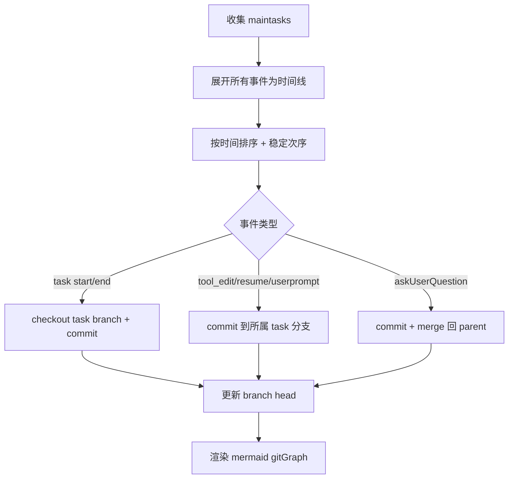

## 目标与约束
- 让 taskC 在用户回答后按时间顺序展示：tool_edit → tool_resumetask → taskC0.userprompt → taskC 结束。
- 保持现有 gitGraph 语义，避免破坏已有分支/合并表现。
- 以时间排序为核心，补齐可用的提交/分支/合并策略。

## 现状问题定位
- 目前 walkEvents 只按事件数组的原始顺序生成提交。
- tool_starttasks 会先递归子任务再统一生成 task end 与 allTasksDone，导致子任务事件无法和同级事件交错排序。
- askUserQuestion 与 userprompt 的处理使用固定的 merge/commit 顺序，无法按真实时间重排。

## 设计方案
### 1) 事件时间线标准化
- 将所有事件（含 task start/end、子任务内事件、ask/answer/userprompt 等）展开为“扁平时间点列表”。
- 对每条事件计算排序 key：starttime 或 endtime（根据事件语义），并记录其所属 branch 与 parent branch。
- 对同一时间点设定稳定的次序规则（例如：start → tool_edit → tool_resumetask → userprompt → end）。

### 2) 分支管理策略
- 为每个 task 分配 branch；maintasks 为 main 分支。
- 当事件发生在 task 分支时：checkout(taskBranch) → commit。
- 当用户回答需要回到 parent：checkout(parentBranch) → merge(taskBranch)。
- 对 askUserQuestion / userprompt 关联，使用同一时间点的 id 作为 merge/cherry-pick 的 parent/tag 规则。

### 3) GitGraph 生成流程
- 先遍历 main.tasks 构建 branch 列表。
- 用扁平化时间线驱动 commit/merge，保证真实时间顺序。
- 在时间线收尾处补齐 task end / allTasksDone。

## 需要修改的代码范围
- SessionTimelinePanel.tsx
  - 新增“事件展开+排序”逻辑
  - 替换 walkEvents 的递归顺序生成策略
  - 调整 ask/userprompt 的 commit/merge/cherry-pick 触发点

## 伪流程图（Mermaid）

## 验证方式
- 在 mockTimelineData 中构造 taskC/tool_edit/tool_resumetask/userprompt 的时间顺序用例。
- 观察 gitGraph 输出顺序是否符合预期。
- 页面渲染后检查时间线的提交排列是否正确。
