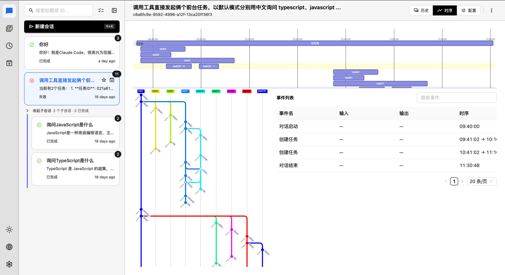
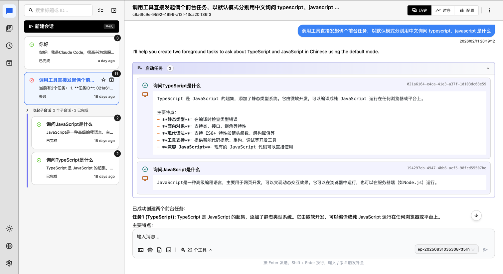
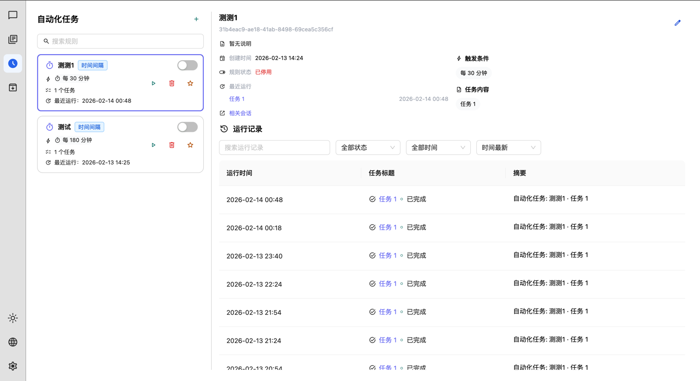
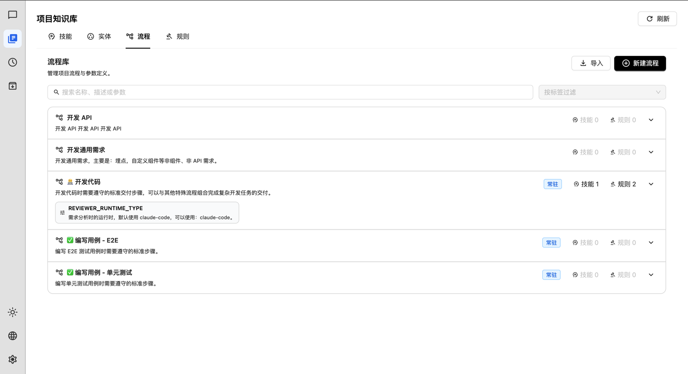

# Vibe Forge AI

Vibe Forge 是一个 AI 辅助开发框架，提供 Web UI 与 CLI，支持插件化适配器与任务编排。

## 关键能力

- **对话式交互**：流式输出、会话管理、工具调用可视化。
- **任务与自动化**：会话归档、规则触发、运行记录统一管理。
- **可扩展架构**：适配器与插件分层，配置驱动、易于接入。

## 产品截图

## 使用指南

- [在自己项目中使用](./docs/USAGE.md)
- [本仓库开发与贡献](./docs/DEVELOPMENT.md)
- [架构说明](./.trae/rules/architecture.md)

## 许可证

[LICENSE](./LICENSE)
