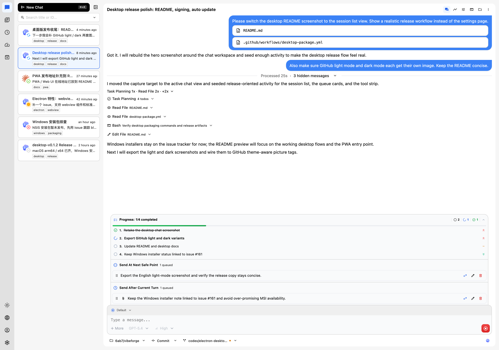

# Vibe Forge AI

en-US | [zh-Hans](./README.zh-Hans.md)

Vibe Forge is an AI-assisted development framework with a desktop app, PWA / Web UI, and CLI. It combines adapter-driven model access, task orchestration, and multi-service workflows in one workspace.

## Product Preview

<picture>
  <source media="(prefers-color-scheme: dark)" srcset="./.docs/en/desktop-chat-dark.png">
  
</picture>

## Online Entry

- PWA / Web UI: [https://vibe-forge-ai.github.io/pwa/](https://vibe-forge-ai.github.io/pwa/)

## Key Capabilities

- **Conversational workflow**: streaming responses, session management, and tool-call visualization.
- **Tasks and automation**: session archive, rule triggers, and run history in one place.
- **Extensible architecture**: adapters and plugins with config-driven integration.
- **Multiple entry points**: desktop app, PWA / Web UI, and CLI for standalone use or project integration.

## Installation

### Desktop App

- Download `desktop-v*` assets from [GitHub Releases](https://github.com/vibe-forge-ai/vibe-forge.ai/releases).
- macOS: Intel (`x64`) and Apple Silicon (`arm64`) builds ship as `.dmg` and `.zip`.
- Windows: the installer is still tracked in [#161](https://github.com/vibe-forge-ai/vibe-forge.ai/issues/161).
- Linux: `.AppImage`, `.deb`, and `.tar.gz`.
- Current desktop release / CI artifacts are unsigned, so your OS may show a security prompt on first launch.

### CLI

- Homebrew: `brew install vibe-forge-ai/tap/vibe-forge`
- Homebrew bootstrap: `brew install vibe-forge-ai/tap/vibe-forge-bootstrap`
- Windows PowerShell: `irm https://raw.githubusercontent.com/vibe-forge-ai/vibe-forge.ai/master/scripts/install-windows.ps1 | iex`
- Scoop: `scoop bucket add vibe-forge https://github.com/vibe-forge-ai/scoop-bucket; scoop install vibe-forge`

### Add Web UI / CLI to Your Project

```bash
pnpm add -D @vibe-forge/server @vibe-forge/client @vibe-forge/cli @vibe-forge/adapter-claude-code
```

## Usage

### Desktop App

- Download and launch the desktop app to get started.
- The desktop app starts a local Vibe Forge service automatically, so you do not need to run `vfui-server` separately.
- Local desktop mode disables `webAuth` by default.
- Launching the installed app without a workspace opens a project picker first, so the desktop flow always continues with a selected workspace.
- Running `npx @vibe-forge/bootstrap app` from a project folder passes that folder into the desktop app. Reopening the same folder reuses the existing local service and focuses the existing window.
- Running `npx @vibe-forge/bootstrap app` from different project folders opens multiple project windows inside the same desktop process, with one local service per workspace.
- Desktop connection flow, backend switching, and local mode notes: [Desktop App](./.ai/docs/usage/desktop.md)

### PWA / Web UI

- Hosted entry: [https://vibe-forge-ai.github.io/pwa/](https://vibe-forge-ai.github.io/pwa/)
- Setup, self-hosting, and backend connection notes: [PWA and Standalone Deployment](./.ai/docs/usage/pwa.md)

### Run the Desktop App from Source

```bash
pnpm desktop:dev
pnpm desktop:package
pnpm desktop:make
npx @vibe-forge/bootstrap app
```

### Run Web UI / CLI in Your Project

- [Installation and Setup](./.ai/docs/usage/install.md)
- [Runtime Guide](./.ai/docs/usage/runtime.md)
- [Desktop App](./.ai/docs/usage/desktop.md)
- `npx @vibe-forge/bootstrap web`
- `npx @vibe-forge/bootstrap server`
- `npx @vibe-forge/bootstrap run "summarize the repo"`

## Docs

- [Use Vibe Forge in Your Project](./.ai/docs/index.md)
- [Installation and Setup](./.ai/docs/usage/install.md)
- [Desktop App](./.ai/docs/usage/desktop.md)
- [PWA and Standalone Deployment](./.ai/docs/usage/pwa.md)
- [Runtime Guide](./.ai/docs/usage/runtime.md)
- [Repository Development Guide](./.ai/rules/DEVELOPMENT.md)

## License

[LICENSE](./LICENSE)
