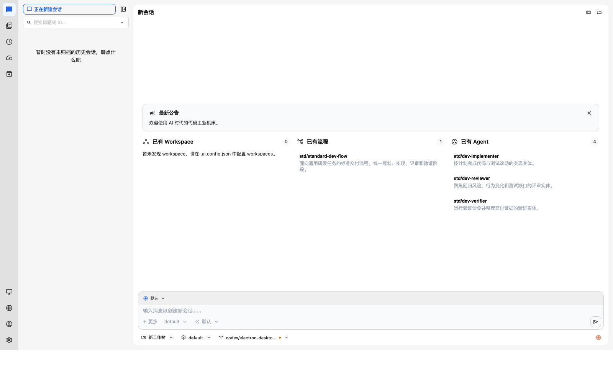

# Vibe Forge AI

Vibe Forge 是一个 AI 辅助开发框架，提供桌面应用、Web UI 与 CLI，支持插件化适配器、任务编排和多服务端接入。

## 最新界面



## 关键能力

- **对话式交互**：流式输出、会话管理、工具调用可视化。
- **任务与自动化**：会话归档、规则触发、运行记录统一管理。
- **可扩展架构**：适配器与插件分层，配置驱动、易于接入。
- **多入口运行**：桌面应用内置本机服务，也支持切到远端执行服务。

## 产品截图


## 安装方式

### 桌面应用

- 从 [GitHub Releases](https://github.com/vibe-forge-ai/vibe-forge.ai/releases) 下载 `desktop-v*` 发布产物。
- macOS：Intel（`x64`）与 Apple Silicon（`arm64`）分别提供 `.dmg`、`.zip`
- Windows：正式安装包暂未提供，后续补发见 [#161](https://github.com/vibe-forge-ai/vibe-forge.ai/issues/161)
- Linux：`.AppImage`、`.deb`、`.tar.gz`
- 当前桌面 release / CI artifact 默认不签名，首次启动时系统可能会提示安全确认。

### CLI

- Homebrew 安装：`brew install vibe-forge-ai/tap/vibe-forge`
- Windows PowerShell 安装：`irm https://raw.githubusercontent.com/vibe-forge-ai/vibe-forge.ai/master/scripts/install-windows.ps1 | iex`
- Scoop 安装：`scoop bucket add vibe-forge https://github.com/vibe-forge-ai/scoop-bucket; scoop install vibe-forge`

### 在项目里接入 Web UI / CLI

```bash
pnpm add -D @vibe-forge/server @vibe-forge/client @vibe-forge/cli @vibe-forge/adapter-claude-code
```

## 使用方式

### 直接用桌面应用

- 桌面应用启动后会自动拉起本机 Vibe Forge 服务，不需要额外执行 `vfui-server`
- 本机服务默认关闭 `webAuth`
- 可以从账号菜单切换到其他远端 Vibe Forge 服务端，把桌面端当作统一控制台

### 从源码试用桌面端

```bash
pnpm desktop:dev
pnpm desktop:package
pnpm desktop:make
```

### 在自己项目中跑 Web UI / CLI

- 参考 [安装与准备](./.ai/docs/usage/install.md)
- 参考 [启动服务](./.ai/docs/usage/runtime.md)
- 参考 [桌面应用](./.ai/docs/usage/desktop.md)

## 文档入口

- [在自己项目中使用](./.ai/docs/index.md)
- [安装与准备](./.ai/docs/usage/install.md)
- [桌面应用](./.ai/docs/usage/desktop.md)
- [启动服务](./.ai/docs/usage/runtime.md)
- [通用 Hooks 方案（含 `.ai/.mock` native 配置）](./.ai/rules/HOOKS.md)
- [Hooks 开发与维护参考](./.ai/rules/HOOKS-REFERENCE.md)
- [本仓库开发与贡献](./.ai/rules/DEVELOPMENT.md)
- [架构说明](./.ai/rules/ARCHITECTURE.md)

## 许可证

[LICENSE](./LICENSE)
