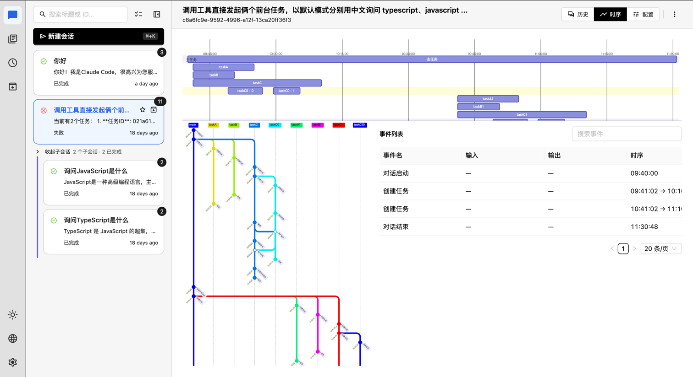
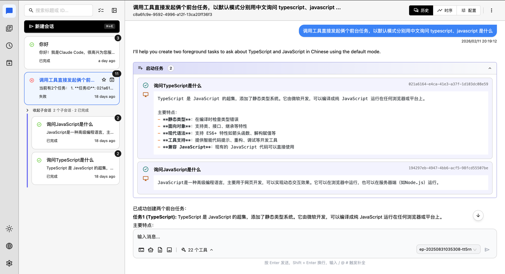
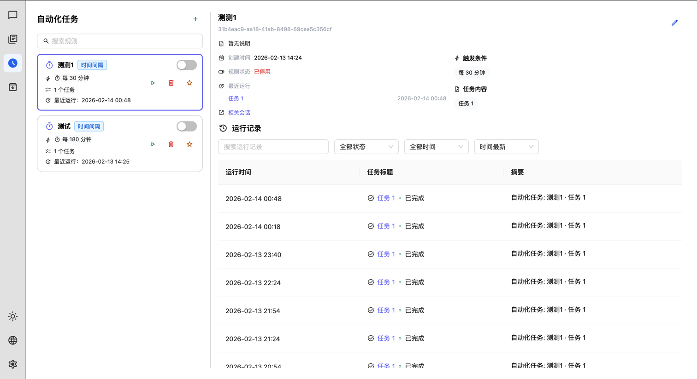
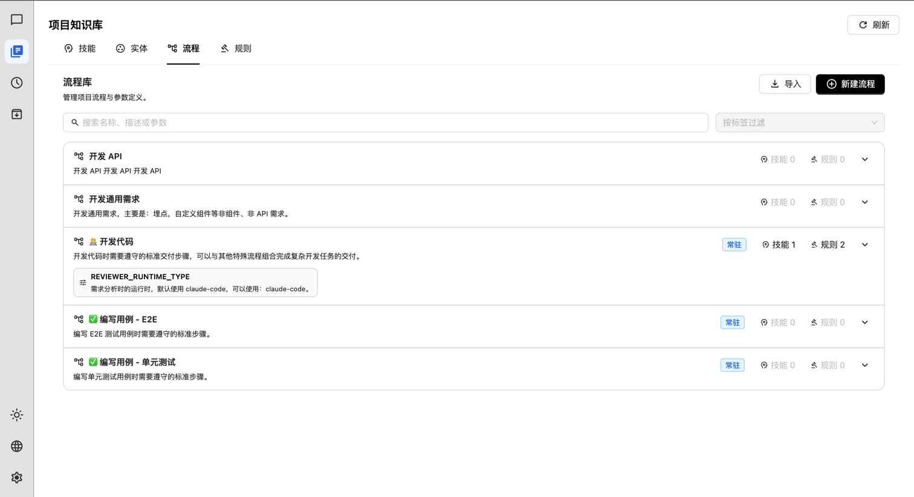

# Vibe Forge AI

Vibe Forge 是一个 AI 辅助开发框架，提供 Web UI 与 CLI，支持插件化适配器与任务编排。

## 关键能力

- **对话式交互**：流式输出、会话管理、工具调用可视化。
- **任务与自动化**：会话归档、规则触发、运行记录统一管理。
- **可扩展架构**：适配器与插件分层，配置驱动、易于接入。

## 产品截图

## 使用指南

- Homebrew 安装 CLI：`brew install vibe-forge-ai/tap/vibe-forge`
- Windows PowerShell 安装 CLI：`irm https://raw.githubusercontent.com/vibe-forge-ai/vibe-forge.ai/master/scripts/install-windows.ps1 | iex`
- Scoop 安装 CLI：`scoop bucket add vibe-forge https://github.com/vibe-forge-ai/scoop-bucket; scoop install vibe-forge`
- [在自己项目中使用](./.ai/docs/index.md)
- [通用 Hooks 方案（含 `.ai/.mock` native 配置）](./.ai/rules/HOOKS.md)
- [Hooks 开发与维护参考](./.ai/rules/HOOKS-REFERENCE.md)
- [本仓库开发与贡献](./.ai/rules/DEVELOPMENT.md)
- [架构说明](./.ai/rules/ARCHITECTURE.md)

## 许可证

[LICENSE](./LICENSE)
